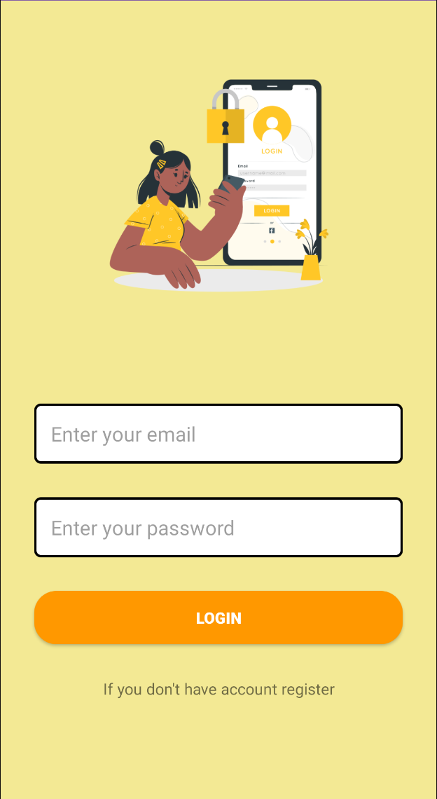
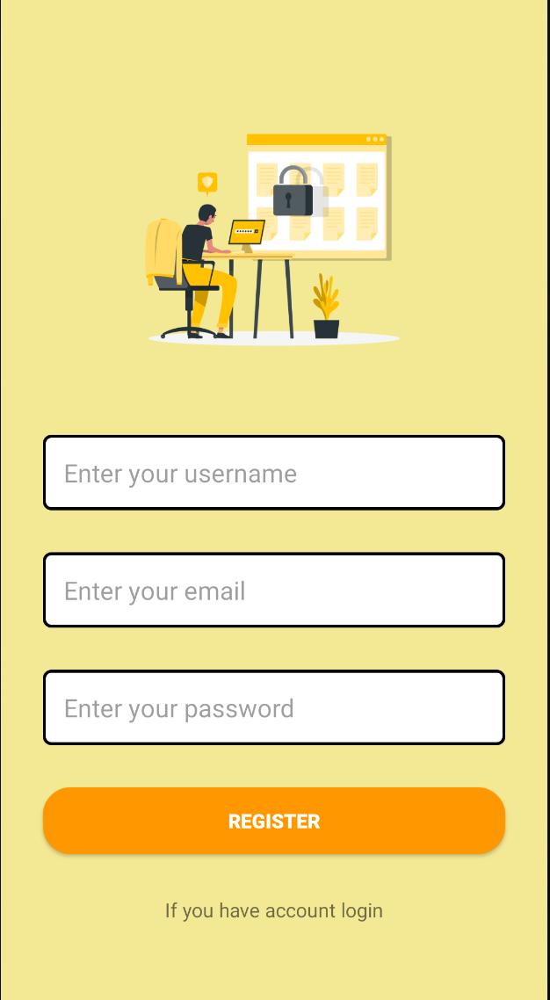
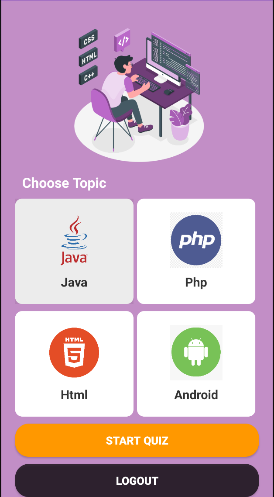
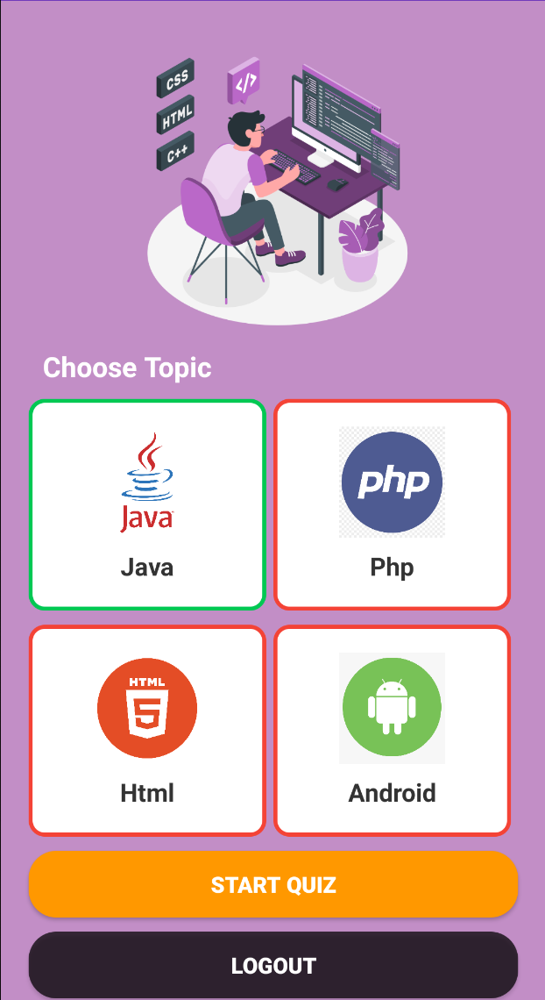
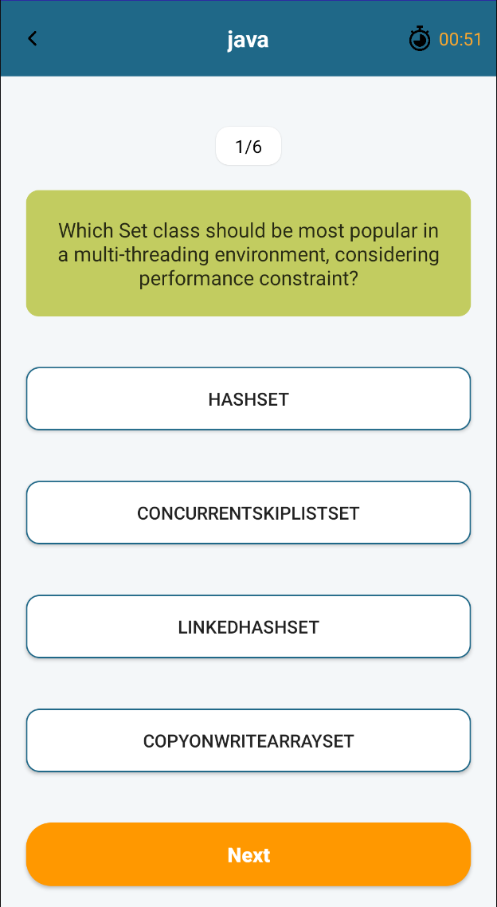
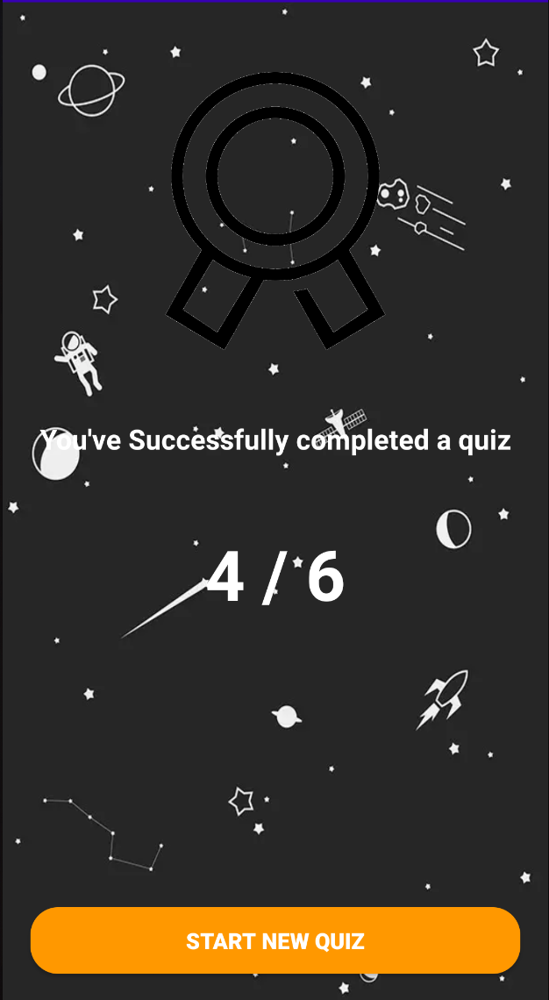

[](#contributors-)

<h1 align="center">
  <a href="https://safdarjamal.github.io/quiz-app/">
    Quiz App
  </a>
</h1>
<br>

<p align="center">
    <a href="#">
        
    </a>
    <a href="#">
        
    </a>
    <a href="#">
        
    </a>
</p>
<br>


<p align="center">
  
  
  
</p>
<br>

# Quiz App with Android Studio and Firebase
🏆 QuizApp is a free and open-source quiz application that lets you play fully programming quizzes right in your phone.
<br>

# Build With
- [Java](http://reactjs.org)
- [Android](https://semantic-ui.com)
- [Firebase](https://opentdb.com/api_config.php)

<br>

## Development

To get a local copy of the code, clone it using git:

```
git clone https://github.com/a-chikeb/Quiz_AndroidApp.git
cd quiz_androidapp
```

```
Open App in android studio and run app
```

## UI
<p align="center">
  
   
</p>

<p align="center">
  
   
</p>

<p align="center">
  
   
</p>
